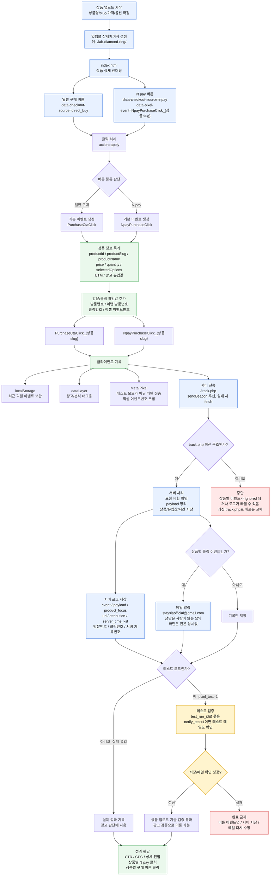

# 잇템몰 아이템 테스트

이 폴더는 잇템몰 신상품 후보를 찾고, 상품 업로드/상세페이지 제작/N pay 버튼 픽셀 세팅을 기본값으로 처리한 뒤, 필요할 때 별도 승인 후 Meta 광고 검증까지 이어가는 프로젝트 폴더다.

핵심 원칙:

- `아이템 발굴`, `상품 업로드`, `Meta 광고 검증`, `Toss 실제 결제수단 세팅`은 각각 다른 작업이다.
- 아이템 발굴 단계에서는 결제, 광고 전환 추적, 잇템몰 반영, CTA 테스트, Meta 캠페인 게재를 묻거나 진행하지 않는다.
- 상품 업로드 단계는 `상세페이지 제작`과 `N pay 버튼 픽셀 세팅`을 기본 포함한다.
- Meta 광고 검증은 오토레이터와 다른 잇템몰 전용 세팅으로 진행한다. 잇템몰은 상품 상세와 N pay 버튼 클릭 반응을 중심으로 본다.
- Toss 결제수단 세팅은 차후 실제 Toss 결제를 받기 위한 별도 작업이다. 현재 아이템 발굴/상품 업로드 기본값에는 섞지 않는다.

## 현재 기준 워크플로우 (2026-07-08)

이 도표는 2026-07-03 현재 MD 기준으로, 어디까지가 고정 규칙이고 어디부터 Codex 판단 또는 사용자 승인이 필요한지 구분한 잇템몰 아이템 테스트 작동 방식이다.

색 기준:

- 파랑: MD에 고정된 규칙
- 초록: Codex가 판단/작성하는 영역
- 노랑: 사용자 승인 필요
- 빨강: 대기, 중단, 또는 금지 흐름

```mermaid
flowchart TD
    A["사용자 입력<br/>예: 랩다이아 반지<br/>신사업 발굴 / 시장 조사 / 새 아이템 시작"] --> B{"이거 잇템몰에 올려서<br/>반응 볼 아이템인가?"}

    B -->|아니오| B0["일반 신사업 발굴<br/>잇템몰 상품 추가로 진행하지 않음"]
    B -->|예| C["잇템몰 아이템 테스트 시작"]

    C --> D["먼저 읽는 고정 문서"]
    D --> D1["잇템몰 AGENTS.md<br/>작업 범위 / 금지 문구 / 픽셀 / 광고 기준"]
    D --> D2["ittem_item_test 잇템몰_아이템_테스트_개요.md<br/>발굴 / 업로드 / 광고 / Toss 분리"]
    D --> D3["상세페이지_기본_템플릿.md<br/>상세페이지 구조 / 가격 / 이미지 / N pay 버튼 기준"]
    D --> D4["흰색_웹디자인_테마.md<br/>화이트 기본값 / 테두리 / 여백 / 진한 배경 금지"]
    D --> D5["index.html<br/>실제 상품 화면 / 버튼 / 상태 저장"]
    D --> D6["track.php<br/>상품별 버튼 기록 / 서버 저장 / 메일 알림"]
    D --> D7["purchase tracking 문서<br/>메일 읽는 법 / 방문번호 / 클릭번호"]

    D1 --> E{"작업 종류 확정"}
    D2 --> E
    D3 --> E
    D4 --> E
    D5 --> E
    D6 --> E
    D7 --> E

    E --> E1["아이템 발굴"]
    E --> E2["상품 업로드 / 상세페이지 제작"]
    E --> E3["Meta 광고 라이브러리 참고 조사<br/>광고비 안 씀"]
    E --> E4["Meta 실제 광고 집행<br/>광고비 사용 / 사용자 승인 필요"]
    E --> E5["Toss 실제 결제 세팅<br/>지금은 인지만 함 / 나중에 별도"]

    E1 --> F1["아이템 발굴만 진행<br/>상품 추가 / 광고 집행 / 결제는 아직 안 함"]
    F1 --> F2["1차 수요 조사<br/>쇼핑인사이트 최근 2주 순위권<br/>검색트렌드/검색광고 API는 선택 보조"]
    F2 --> F2A["Meta 광고 라이브러리 기준 이미지/소구 확인<br/>쿠팡 판매가/리뷰/배송 신호 확인"]
    F2A --> F2B{"아이템축 통과?"}
    F2B -->|예| F2C["도매꾹 상품 선별<br/>아이템축당 후보 3개<br/>Meta 이미지 유사도 / 쿠팡 가격 대비 도매가 / MOQ 확인"]
    F2B -->|아니오| F3["결과물<br/>후보 키워드표<br/>상품 후보 점수표<br/>진행 / 보류 판단"]
    F2C --> F2D["후보 부족 시 보강 검색<br/>조건부 / 보류 / 피벗 후보 표시"]
    F2D --> F3

    E2 --> G["상품 업로드 시작"]

    G --> G0{"테마나 포인트 컬러를<br/>사용자가 따로 말했나?"}
    G0 -->|아니오| G0A["묻지 않고 화이트 기본 템플릿 시작<br/>흰색 / 검정 중심<br/>기본 포인트 컬러 없음"]
    G0 -->|예| G0B["사용자 지정 테마 적용<br/>단, 해당 숨김 단독몰 안에서만 사용"]
    G0A --> G1
    G0B --> G1

    G1["숨김 단독몰 구조 적용"] --> G1A["잇템몰 본사이트에 노출하지 않음"]
    G1 --> G1B["키워드별 하위 URL에서만 노출<br/>예: /lab-diamond-ring/"]
    G1 --> G1C["홈 / 로고 / 메뉴 / 완료 CTA가<br/>잇템몰 본점으로 빠지지 않게 함"]

    G1A --> H["가격 조사"]
    G1B --> H
    G1C --> H

    H --> H1["쿠팡 검색 결과/상위 상품 확인"]
    H1 --> H2["상품명 / 판매가 / 리뷰수 / 별점 / 배송 / 판매자 / URL 기록"]
    H2 --> H3["광고/스폰서성 노출과 일반 판매 상품 구분"]
    H3 --> H4["비슷한 구성의 실제 판매가 범위 확인"]
    H4 --> H5["중간 가격대와 잇템몰 목표 가격 비교"]

    H5 --> H5A["원가 조사는 판매가 조사와 분리"]
    H5A --> H5B{"원가 조사 방향 확인"}
    H5B -->|실물 상품| H5C["도매꾹 후보 3개 우선 확인<br/>Meta 기준 이미지/소구와 쿠팡 판매가를 같이 비교<br/>원가 / MOQ / 배송 / 인증 위험 기록"]
    H5B -->|비재화 상품| H5D["제작비 / 운영비 / 수수료 / 인건비 / 환불 위험 기준으로 조사"]
    H5C --> H5E["원가율 30% 기준 판단<br/>넘으면 가격 조정 / 소싱 재검토 / 보류 후보"]
    H5D --> H5E
    H5E --> H6["Codex 초안 작성<br/>상품명 / 옵션 / 구매 이유 3개 / 설명 / 이미지 방향"]

    H6 --> I["상세페이지 구성"]
    I --> I1["전용 주소"]
    I --> I2["대표 이미지"]
    I --> I3["상품명 / 가격 / 옵션"]
    I --> I4["핵심 구매 이유 3개"]
    I --> I5["상세 설명 / 사용 장면"]
    I --> I6["사양 / 구성품 / 배송 / 교환 / 환불"]
    I --> I7["사이즈 상품이면<br/>사이즈 옵션 / 사이즈표 / 측정 기준 추가"]
    I --> I8["고객 화면 금지어 제거<br/>테스트 / 검증 / 반응 확인 / 페이크도어 금지"]
    I --> I9["상품 카드 썸네일<br/>1080 x 1350px<br/>비율 4:5<br/>가로/정사각형 이미지 그대로 사용 금지"]

    I --> J{"화이트 테마인가?"}
    J -->|예| J1["흰 배경 유지<br/>검정/진한 배경 박스 금지<br/>얇은 테두리 / 선 / 여백으로 강조"]
    J -->|아니오| J2["선택한 테마 기준 적용"]

    J1 --> K["index.html 반영"]
    J2 --> K

    K --> K1["상품 데이터 추가"]
    K --> K2["상품 목록/상세 연결"]
    K --> K3["옵션 선택 연결"]
    K --> K4["선택값 / 수량 / 보던 위치 저장"]
    K --> K5["버튼 2개 연결"]

    K5 --> L1["바로 구매하기 버튼"]
    K5 --> L2["N pay 구매 버튼"]

    L1 --> M1["전체 이벤트<br/>PurchaseCtaClick"]
    L1 --> M2["상품별 이벤트<br/>PurchaseCtaClick_상품slug"]

    L2 --> M3["전체 이벤트<br/>NpayPurchaseClick"]
    L2 --> M4["상품별 이벤트<br/>NpayPurchaseClick_상품slug"]

    M1 --> N["브라우저 기록"]
    M2 --> N
    M3 --> N
    M4 --> N

    N --> N1["localStorage<br/>최근 버튼 기록"]
    N --> N2["dataLayer<br/>광고/분석 기록"]
    N --> N3["Meta Pixel<br/>실제 유입일 때만 전송<br/>픽셀 이벤트번호 포함"]

    N --> O["서버 전송<br/>/track.php"]

    O --> P{"track.php 최신 구조인가?"}
    P -->|아니오| P0["중단<br/>상품별 기록이 빠질 수 있음<br/>최신 track.php로 교체"]
    P -->|예| Q["서버 기록 저장"]

    Q --> Q1["event 저장"]
    Q --> Q2["productSlug 저장"]
    Q --> Q3["상품명 / 가격 / 수량 저장"]
    Q --> Q4["주소 / 유입값 저장"]
    Q --> Q5["한국 시간 저장"]
    Q --> Q6["방문번호 저장"]
    Q --> Q7["이번 방문번호 저장"]
    Q --> Q8["클릭번호 저장"]
    Q --> Q9["픽셀 이벤트번호 저장"]
    Q --> Q10["서버 기록번호 저장"]

    Q --> R{"상품별 구매 버튼 기록인가?"}
    R -->|예| S["메일 알림 발송<br/>staysiaofficial@gmail.com<br/>상단은 사람이 읽는 요약<br/>하단은 원본 상세값"]
    R -->|아니오| T["기록만 저장"]

    S --> U["운영 전 테스트"]
    T --> U

    U --> U1["운영 주소에<br/>pixel_test=1<br/>test_run_id=...<br/>notify_test=1 붙임"]
    U1 --> U2["바로 구매하기 버튼 클릭"]
    U1 --> U3["N pay 버튼 클릭"]

    U2 --> V["서버 저장 확인"]
    U3 --> V

    V --> W["상품별 이벤트명 확인<br/>방문번호 / 클릭번호 / 픽셀 이벤트번호 확인"]
    W --> X["메일 알림 확인<br/>테스트 표시와 test_run_id 포함"]
    X --> X1["테스트 기록 구분<br/>test_run_id로 실제 성과와 분리"]
    X1 --> Y{"저장 / 이벤트명 / 메일 확인 성공?"}

    Y -->|아니오| Z0["완료 금지<br/>버튼 이벤트명 / 서버 저장 / 메일 다시 수정"]
    Y -->|예| Z["상품 업로드 기술 검증 완료"]

    E3 --> AA["Meta 광고 라이브러리 참고 조사"]
    AA --> AA1["대한민국 / 모든 광고 기준"]
    AA --> AA2["정지 이미지 광고 우선"]
    AA --> AA3["2주 이상 돌고 있는 광고 우선"]
    AA --> AA4["이미지 구도 / 카피 길이 / 가격 표시 방식 확인"]
    AA --> AA5["그대로 베끼지 않고<br/>잇템몰 상품용 새 이미지 방향만 뽑음"]
    AA5 --> AA6["광고 이미지 만들 때<br/>쿠팡 상위 상품 이미지와<br/>Meta 정지 이미지 광고를 같이 봄"]
    AA6 --> AA7["1차 이미지 생성<br/>문구 / 가격 없이<br/>제품 / 착용 / 배경 / 현실감만 맞춤"]
    AA7 --> AA8["2차 최종 Meta 광고 이미지 생성<br/>짧은 카피 + 가격 + Pretendard<br/>이미지 안에 자연스럽게 포함"]
    AA8 --> H6

    Z --> AB{"실제 광고 집행 승인 받았나?"}
    E4 --> AB

    AB -->|아니오| AB0["대기<br/>광고비 사용 안 함"]
    AB -->|예| AC["Meta 실제 광고 집행"]

    AC --> AC1["메인 광고계정 사용<br/>act_4318982484828851<br/>페이지 잇템몰 1069905426214093"]
    AC --> AC2["캠페인<br/>잇템몰_아이템검증"]
    AC --> AC3["아이템마다 새 광고 세트 생성<br/>학습 / 예산 / 성과 분리"]
    AC --> AC4["광고비<br/>기본 판매가 x 20%<br/>최신 지시 100,000원 가능"]
    AC --> AC5["목표 CPC<br/>판매가 x 0.004"]
    AC --> AC6["광고 링크는 상품 상세 URL로 연결"]

    AC6 --> AD["성과 확인"]
    AD --> AD1["CTR<br/>광고를 눌렀나"]
    AD --> AD2["CPC<br/>클릭 비용이 괜찮나"]
    AD --> AD3["상세페이지 진입"]
    AD --> AD4["상품별 N pay 클릭"]
    AD --> AD5["상품별 바로 구매 클릭"]
    AD --> AD6["Meta 표에 구매/N pay가 없으면<br/>서버 로그와 버튼 기록을 따로 확인"]

    AD1 --> AE{"상품 판단"}
    AD2 --> AE
    AD3 --> AE
    AD4 --> AE
    AD5 --> AE
    AD6 --> AE

    AE -->|좋음| AF["계속 판매 / 광고 확대"]
    AE -->|애매함| AG["가격 / 사진 / 문구 수정 후 재검증"]
    AE -->|나쁨| AH["상품 보류 또는 중단"]

    E5 --> AI["현재 흐름에서는 진행하지 않음<br/>실제 결제 받을 때 별도 작업으로 다시 시작"]

    B:::owner
    G0:::owner
    H5B:::owner
    AB:::owner

    D:::fixed
    D1:::fixed
    D2:::fixed
    D3:::fixed
    D4:::fixed
    D5:::fixed
    D6:::fixed
    D7:::fixed
    F2:::fixed
    F2A:::fixed
    F2C:::fixed
    G0A:::fixed
    G1:::fixed
    G1A:::fixed
    G1B:::fixed
    G1C:::fixed
    H1:::fixed
    H2:::fixed
    H4:::fixed
    H5:::fixed
    H5A:::fixed
    H5E:::fixed
    I9:::fixed
    J1:::fixed
    M2:::fixed
    M4:::fixed
    O:::fixed
    Q:::fixed
    Q6:::fixed
    Q7:::fixed
    Q8:::fixed
    Q9:::fixed
    Q10:::fixed
    S:::fixed
    U1:::fixed
    X1:::fixed
    AA6:::fixed
    AA7:::fixed
    AA8:::fixed
    AC1:::fixed
    AC2:::fixed
    AC4:::fixed
    AC5:::fixed
    AD6:::fixed
    AI:::fixed

    G0B:::codex
    F2D:::codex
    H5C:::codex
    H5D:::codex
    H6:::codex
    I:::codex
    AA5:::codex
    AG:::codex

    B0:::stop
    P0:::stop
    Z0:::stop
    AB0:::stop
    AH:::stop

    classDef fixed fill:#e8f1ff,stroke:#2f6fdd,color:#111;
    classDef codex fill:#eaf8ec,stroke:#2f9e44,color:#111;
    classDef owner fill:#fff4ce,stroke:#d89b00,color:#111;
    classDef stop fill:#ffe8e8,stroke:#d64545,color:#111;
```

## 기술 워크플로우: 상품별 픽셀/서버 로그 필수 (2026-07-02)

잇템몰 상품 업로드는 상품 페이지가 보이는 것만으로 완료하지 않는다. 상품별 N pay 버튼과 일반 구매 버튼이 각각 고유 이벤트로 찍히고, 운영 서버 로그와 메일 알림까지 확인되어야 광고 검증으로 넘어갈 수 있다.

필수 이벤트:

- 전체 N pay 버튼 클릭: `NpayPurchaseClick`
- 상품별 N pay 버튼 클릭: `NpayPurchaseClick_{상품slug}`
- 전체 일반 구매 버튼 클릭: `PurchaseCtaClick`
- 상품별 일반 구매 버튼 클릭: `PurchaseCtaClick_{상품slug}`

버튼 클릭 기록은 운영자가 메일만 보고도 판단할 수 있어야 한다.

- 메일 상단에는 `결제 완료 아님`, 버튼 종류, 상품명, 옵션, 금액, 시간, 유입을 먼저 보여준다.
- 긴 URL, `fbclid`, UTM 원본은 하단 상세값으로 둔다.
- 모든 구매 관련 버튼 기록에는 방문번호, 이번 방문번호, 클릭번호, 픽셀 이벤트번호, 서버 기록번호를 같이 남긴다.
- 방문번호가 같으면 같은 브라우저 방문자일 가능성이 높고, 클릭번호가 같으면 같은 버튼 클릭 묶음으로 본다.
- `fbclid`는 사람 고유번호가 아니라 메타 광고 클릭 흐름값으로 본다.
- 메타 픽셀 ID는 잇템몰 픽셀 번호이며, 사람마다 바뀌는 값이 아니다.

관련 파일:

- `index.html`: 버튼 렌더링, 상품별 이벤트명 생성, 클릭 이벤트 전송
- `track.php`: 서버 로그 저장, 상품별 클릭 메일 알림, 테스트 기록 구분
- `payment/tracking-report.php`: 관리자 토큰이 있을 때 공식 서버 기록을 읽는 확인 통로
- `payment/server-config-lib.php`, `payment/rate-limit-lib.php`: `track.php`가 의존하는 설정/제한 파일
- `build/ittemmall-public/track.php`: 배포 패키지에 들어갈 최신 기준 서버 기록 파일

## 시작 트리거

사용자가 아래처럼 말하면 이 프로젝트로 시작한다.

- `잇템몰 아이템 테스트 시작하자`
- `이템몰 아이템 테스트 시작`
- `잇템몰 아이템 검증 시작`
- `잇템몰 아이템 찾아보자`
- `잇템몰 새로운 아이템 발굴해보자`
- `잇템몰 신상품 테스트`
- `잇템몰 상품 업로드해`
- `잇템몰 상세페이지 만들어`
- `잇템몰에 올려서 반응 보자`

사용자가 `아이템 테스트`라고만 말하면 잇템몰 작업으로 단정하지 말고 먼저 묻는다.

`잇템몰 아이템 테스트를 말하는 건가요, 아니면 다른 아이템 테스트인가요?`

## 시작 질문

잇템몰 아이템 발굴로 시작하면 먼저 아래만 짧게 묻는다. 사용자가 일부만 답해도 나머지는 합리적으로 가정한다.

1. 이미 정한 상품/후보 키워드가 있는가, 아니면 인기 분야 전체에서 찾을까?
2. 우선 볼 카테고리와 제외할 카테고리가 있는가?
3. 희망 판매가, 원가/마진 기준, 최소 객단가 조건이 있는가?

데이터 조회가 필요하면 먼저 어떤 도구를 쓸지 한 줄로 제안하고 확인을 받은 뒤 진행한다. 기본 1차 조합은 `네이버 쇼핑인사이트 최근 2주 순위권 + 성별/연령/기기 반응`이다. 단, 큰 카테고리 인기순위만 보고 후보를 뽑지 않는다. 반드시 `큰 카테고리 -> 하위 카테고리 -> 하위별 인기 키워드` 순서로 내려가서 본다. 1차 수요 확인을 통과한 후보만 다음 단계에서 `쿠팡 가격/리뷰/배송 신호 + Meta 광고 라이브러리`를 확인한다. 네이버 쇼핑 상위 상품은 자동 접근이 막히거나 데이터가 불안정하면 기본값으로 쓰지 않고, 필요할 때만 보조로 본다. 네이버 검색광고 API는 Meta 광고로 반응을 볼 잇템몰 구조에서는 필수 통과 기준으로 쓰지 않고, 검색량이나 연관 키워드를 보완할 때만 선택적으로 쓴다.

### 상품 조사 시작 흐름

사용자가 상품 조사, 새 아이템 발굴, 상품 조사 시작 흐름을 묻거나 승인하면 아래를 시작 기준으로 본다.

네이버 트렌드 API만 단독으로 시작하지 않는다. 네이버 데이터랩 검색트렌드는 추이, 성별, 연령, 기기 반응을 보완하는 도구로 쓴다.

쇼핑인사이트의 `cat_id`는 네이버 쇼핑 카테고리 번호다. 이번 업무에서는 큰 카테고리의 `cat_id`만 보고 끝내지 않는다. 큰 카테고리의 하위 카테고리 목록을 먼저 펼친 뒤, 시즌과 잇템몰 가격대에 맞는 하위 카테고리를 고르고, 각 하위 카테고리별 최근 2주 인기 키워드를 조회한다.

단, 하위 카테고리를 끝까지 전부 파지는 않는다. 너무 깊게 내려가면 대분류의 시장 수요에서 멀어지고, 부품/소모품/AS성 키워드가 많아져 잇템몰 테스트 상품으로서 엣지가 작아진다. 하위 카테고리는 `상품으로 바로 팔 수 있는 키워드`가 나오는 깊이까지만 본다.

하위 카테고리 조사에서 제외할 것:

- 시즌과 맞지 않는 카테고리: 여름 조사에서 `온풍기`, `히터`, `전기매트`, `전기요` 등
- 부품/AS성 키워드: 리모컨, 필터, 날개, 배터리, 받침대, 거치대 등
- 설치/호환 리스크가 큰 키워드: 실외기거치대, 시스템에어컨 전용 부품 등
- 객단가가 너무 낮은 소모품: 단품 1만 원대 이하 중심 상품
- 브랜드 의존도가 강한 키워드: 특정 대기업 모델명, 특정 브랜드 부품명

적정 깊이 예시:

- 좋음: `계절가전 -> 제습기 -> 미니제습기`
- 좋음: `계절가전 -> 냉풍기 -> 미니냉풍기/원룸냉풍기`
- 좋음: `계절가전 -> 선풍기 -> 냉각손선풍기/무타공벽걸이선풍기`
- 보류: `계절가전 -> 선풍기부속품 -> 선풍기날개`
- 보류: `계절가전 -> 에어컨주변기기 -> 삼성에어컨리모컨`

여름 소형가전 후보를 볼 때 우선 확인할 대표 `cat_id`:

- `50000003`: 디지털/가전
- `50000212`: 디지털/가전 > 계절가전
- `50000210`: 디지털/가전 > 생활가전
- `50000214`: 디지털/가전 > 자동차기기
- `50000007`: 스포츠/레저
- `50000008`: 생활/건강

1차 상품 조사 시작 흐름:

1. `네이버 쇼핑인사이트`: 큰 카테고리와 하위 카테고리 목록을 먼저 받는다.
2. 시즌, 가격대, 배송/반품 부담을 기준으로 볼 하위 카테고리와 제외할 하위 카테고리를 나눈다.
3. 하위 카테고리는 끝까지 전부 파지 않고, 상품으로 바로 팔 수 있는 키워드가 나오는 깊이까지만 본다.
4. 선택한 하위 카테고리별로 최근 2주 기준 Top 10~20 키워드를 조회한다.
5. 대형가전, 설치형, 고가, 부품/AS성, 소모품성, 브랜드 의존도가 큰 키워드는 1차에서 제외한다.
6. `쇼핑인사이트 성별/연령/기기 반응`: 남은 키워드가 누구에게 강한지 본다.
7. `네이버 데이터랩 검색트렌드`: 쇼핑인사이트만으로 부족할 때 검색 추이 보완용으로 본다.

1차 통과 기준:

- 쇼핑인사이트 최근 2주 순위권에 들어 수요가 이미 확인됐는가
- 성별/연령 반응이 상품 타깃으로 설명 가능한가
- 4만~7만 원대 테스트 판매가로 맞출 가능성이 있는가

1차를 통과하면 상품 조사의 다음 단계로 아래를 제안한다.

1. `Meta 광고 라이브러리`: 이미 광고가 2주 이상 돌고 있는지, 어떤 이미지와 카피가 쓰이는지 먼저 확인한다.
2. `쿠팡 상위/검색 결과 상품`: 실제 판매가, 구성품, 리뷰수, 별점, 배송, 판매자, 가격대를 확인한다.
3. `도매꾹 1차 상품 선별`: Meta에서 확인한 이미지/소구와 쿠팡 판매가를 기준으로, 실제로 가져올 만한 도매꾹 상품이 있는지 확인한다.

이 흐름에서는 Meta 광고 라이브러리가 이미지와 소구의 기준이고, 쿠팡은 소비자가 실제로 받아들이는 가격 기준이다. 도매꾹은 이 단계에서 시장성을 다시 증명하는 도구가 아니다. 쇼핑인사이트, Meta 광고 라이브러리, 쿠팡으로 아이템축의 수요와 광고 반응 가능성을 먼저 본 뒤, 도매꾹에서는 그 후보축 안에서 `Meta에서 확인한 이미지/소구와 닮았는가`, `쿠팡 판매가 대비 도매가가 마진을 만들 수 있는가`, `MOQ가 낮은가`를 빠르게 본다. KC, AS, 이미지 라이선스, 배송 조건은 1차 탈락 보조 신호로 보되, 핵심 판단은 `광고 이미지 적합성 + 쿠팡 가격 대비 원가력`이다.

도매꾹 1차 선별 기준:

1. 검증된 아이템축마다 도매꾹 상품 후보를 최소 3개씩 골라둔다.
2. Meta 광고 라이브러리에서 고른 기준 이미지/소구와 상품 썸네일 방향이 맞는가
3. 쿠팡 대표 상품 또는 가격대와 비교했을 때 도매가가 마진을 만들 수 있는가
4. 상품 썸네일만 봐도 용도와 구매 이유가 보이는가
5. 도매가가 39,900원, 49,900원, 59,900원, 69,900원 판매가의 제품 원가 30% 안에 들어오는가
6. MOQ가 1~10개 수준이라 샘플 또는 소량 테스트가 가능한가
7. 후보 키워드와 실제 상품이 맞고, 부품/소모품/오탐이 아닌가
8. 상품 설명 이미지 사용 가능 여부와 배송 조건이 치명적 리스크가 아닌가

도매꾹 보고는 `아이템축 -> 후보 1/후보 2/후보 3` 구조로 남긴다. 전체에서 3개만 고르지 않는다. 가격이나 오탐 때문에 실제 테스트가 어려운 아이템도 후보 3개를 남기되, `보류`, `조건부`, `피벗 후보`로 표시한다.

실제 조회 전에는 아래처럼 한 줄로 확인한다.

`네이버 쇼핑인사이트에서 큰 카테고리의 하위 카테고리까지 펼친 뒤, 최근 2주 순위권 키워드와 성별/연령/기기 반응을 먼저 볼까요?`

1차 조회에서 통과 후보가 나오면 아래처럼 다음 단계를 제안한다.

`1차 수요가 괜찮게 나온 후보만 쿠팡 가격/리뷰/배송 신호와 Meta 광고 라이브러리까지 이어서 볼까요?`

보고할 때는 실제 데이터로 확인한 내용과 Codex가 판단으로 해석한 내용을 구분한다.

상품 업로드 요청이면 Codex가 아래를 먼저 정해서 초안으로 제안한다. 사용자는 원재료, 금지 조건, 최종 승인만 주면 된다.

1. 상품명, 가격, 옵션
2. 대표 이미지와 상세 이미지 방향
3. 상세페이지에서 밀 핵심 구매 이유 3개
4. 제품 사양, 구성품, 배송 조건, 교환/환불 기본값

사이즈가 구매 판단에 영향을 주는 상품은 별도 기본값을 추가한다. 의류, 신발, 장갑, 보호대, 착용 장비, 가구, 수납, 설치형 제품처럼 사이즈 미스가 구매 결정이나 반품에 영향을 줄 수 있으면 `사이즈 옵션`, `상세페이지용 사이즈 설명 이미지`, `사이즈표`, `측정 기준/권장 선택법/실측 오차 안내`를 함께 작성한다. 사이즈 설명 이미지는 Codex가 SVG/HTML 도형으로 직접 그리지 않고 이미지 생성 도구로 만들며, 숫자/표/주의 문구는 HTML 텍스트와 표로 분리한다.

키워드별 하위 URL은 해당 아이템 입장의 전용 메인 페이지로 본다. 예: `/tennis-bracelet/`는 테니스 팔찌 아이템의 전용 메인 페이지이며, 그 안에서 상품 CTA를 누르면 주문/상세 같은 더 깊은 하위 흐름으로 이어질 수 있다. 전용 메인 페이지 포인트 컬러는 Codex가 상품/타깃에 맞춰 먼저 제안하고, 사용자가 특정 컬러를 지정하면 해당 아이템 전용 페이지 범위에서 우선 적용한다.

단, 실제 제품 사진, 공급 조건, 원가/마진, 법적/인증 문구처럼 확인이 필요한 값은 확정한 척하지 않고 사용자 승인값 또는 명시적 가정으로 표시한다.

가격은 해당 키워드의 쿠팡 검색 결과와 상위 노출 상품을 먼저 본 뒤 정한다. 기본 원칙은 아래와 같다.

1. 검색 키워드는 사용자가 준 검증 키워드를 그대로 쓴다. 예: `선풍기조끼`.
2. 쿠팡에서 `상품명 / 판매가 / 구성품 / 리뷰수 / 별점 / 배송 방식 / 판매자 / URL`을 표로 기록한다.
3. 광고 노출, 로켓배송, 일반 판매 상품을 구분한다. 광고 노출 상품도 참고하되 가격 기준을 그 1개로만 잡지 않는다.
4. 브랜드 상품은 기본 배제하지 않는다. 다만 대형 브랜드와 중국산 노브랜드, 자체몰형 브랜드를 구분해서 본다.
5. 최저가 1~2개를 그대로 따라가지 않고, 비슷한 구성의 상품을 가격 오름차순으로 세운 뒤 중간 가격대를 기준으로 본다.
6. 잇템몰 가격 초안은 쿠팡 중간 가격대와 잇템몰 손익 기준을 같이 맞춰 정한다.
7. 가격을 제안할 때는 반드시 `직접 출처가 있는 쿠팡/공개 가격표`와 `Codex가 최종 산정한 판매가`를 구분해서 말한다.

원가 조사는 판매가 조사와 별도로 진행한다. 실물 상품과 비재화 상품 모두 Codex가 조사 방향을 확정하기 전에 사용자에게 짧게 확인한다.

1. 실물 상품이면 먼저 묻는다: `이건 실물 상품으로 보고 알리바바에서 유사 제품 평균 원가를 조사할까요?`
2. 사용자가 동의하면 알리바바/도매 유사 제품 여러 개를 확인해 평균 원가를 잡는다. 최저가 1개만 기준으로 삼지 않고 MOQ, 옵션, 구성품, 배송/수입 비용 가능성, 인증 리스크를 함께 기록한다.
3. 비재화 상품이면 먼저 묻는다: `이건 비재화로 보고 제작비/운영비/수수료 기준으로 원가 구조를 조사할까요?`
4. 사용자가 동의하면 제작비, 운영비, 인건비, 플랫폼 수수료, 라이선스, 고객 응대, 환불 리스크 등 상품 성격에 맞는 원가 구조를 조사한다.
5. 사용자가 다른 조사 기준을 주면 그 기준을 우선한다. 명확한 기준이 없으면 Codex가 상품 성격에 맞는 조사 방향을 제안하고 확인받은 뒤 진행한다.
6. 원가 조사 결과는 판매가 대비 원가율 30% 기준에 들어오는지 판단한다. 30%를 넘으면 가격 조정, 소싱 재검토, 또는 아이템 보류 후보로 본다.

Meta 광고 검증은 별도 요청 또는 승인 후에만 아래를 확인한다.

1. 검증할 상품 상세 URL이 확정됐는가?
2. 광고비 한도와 테스트 기간은 얼마인가?
3. 소재, 카피, 타깃, UTM 기준은 무엇인가?
4. CTR, CPC, 상세 진입률, N pay 클릭률 중 어떤 기준으로 확장/보류/폐기할 것인가?

## 상품 검증 손익 공식

잇템몰 상품 검증은 매출 100 기준 아래 비율을 기본값으로 본다.

| 항목 | 기준 |
|---|---:|
| 광고비 | 20% |
| 제품 원가 | 30% |
| 부대비용 | 20% |
| 순수익 | 30% |

- 이전에 Codex가 임의로 잡은 다른 상품 검증 비율이나 상품당 고정 테스트 예산은 사용하지 않는다.
- 목표 구매 전환율은 2%다. 즉 광고 클릭 50회당 구매 또는 N pay 구매 의향 클릭 1회를 목표로 본다.
- 상품별 허용 광고비는 `판매가 x 20%`다.
- 목표 CPC는 `판매가 x 20% / 50`으로 계산한다. 같은 말로 `판매가 x 0.004`다.
- Meta 테스트 광고비 기본값은 고정 10,000원이 아니라 `판매가 x 20%`다. 운영 편의를 위해 반올림하면 산식과 반올림값을 함께 남긴다.
- 테스트 광고비를 소진했는데 해당 상품의 상품별 N pay 버튼 픽셀 이벤트가 0이면 그 상품은 기본 탈락으로 판단한다.
- 상품이 여러 개일 때 전체 `NpayPurchaseClick`만 보면 섞인다. 각 상품의 N pay 버튼은 `NpayPurchaseClick_{상품slug}` 형식의 상품별 이벤트를 함께 보내고, 검증 판단은 상품별 이벤트 기준으로 한다.

## 상품별 N pay 서버 로그 필수 검증

새 상품을 잇템몰에 올릴 때는 그 상품 고유의 N pay 버튼 로그 클릭값을 서버에서 잡을 수 있어야 한다.

- A 상품이면 `NpayPurchaseClick_{a상품slug}`, B 상품이면 `NpayPurchaseClick_{b상품slug}`처럼 상품별 이벤트를 분리한다.
- 버튼 클릭 payload에는 `productSlug`, `productName`, `value`, `source=npay`, `productScoped=true`가 들어가야 한다.
- 버튼 클릭 payload에는 `visitorId`, `visitId`, `clickId`, `pixelEventId`, `metaPixelId`, `metaBrowserIds`도 들어가야 한다.
- 확인 위치는 Meta 광고 관리자 화면이 아니라 본사이트 서버 로그다.
- 운영 URL에 `?pixel_test=1&test_run_id=...`를 붙여 테스트 클릭을 남긴다.
- 테스트 메일까지 확인해야 할 때는 `notify_test=1`도 함께 붙인다.
- 테스트 로그는 실제 광고 성과와 섞이지 않도록 `pixel_test=1`과 `test_run_id`로 구분한다.
- 필수 확인 순서:
  1. 테스트 클릭
  2. 서버 저장 확인
  3. 상품별 이벤트명 확인
  4. 방문번호/클릭번호/픽셀 이벤트번호 확인
  5. 메일 알림 확인
- 위 검증에서 `stored:true`가 나오지 않거나 상품별 이벤트가 안 찍히거나 메일 알림이 확인되지 않으면 광고 게재 완료로 보지 않는다.

## Meta 광고 직전 패키지 최신 운영 기준 (2026-07-08)

이 기준은 사용자가 `광고 개시 직전까지 준비`, `메타 광고 게시 직전`, `광고 켜기 바로 전까지`라고 말했을 때 강하게 우선한다.

대상 상품:

- 모기퇴치기
- 냉감패드
- 스팀다리미
- 냉각손선풍기

제외 상품:

- 미니제습기

광고계정 / 페이지 / 광고세트 기준:

1. 잇템몰 Meta 광고의 기본 광고계정은 MCP 운영 기준에 저장된 `메인 광고계정` / `act_4318982484828851` / KRW로 본다.
2. 음성 입력 오타나 화면 표시명이 흔들려도 숫자 기준은 `act_4318982484828851`이다.
3. 광고 페이지는 잇템몰 프로젝트 기준으로 `잇템몰` / `1069905426214093`을 사용한다.
4. 광고 생성 전에는 `meta_ads_check_publish_readiness` 또는 같은 수준의 권한 확인으로 `act_4318982484828851`에서 `잇템몰` 페이지 게시가 가능한지 확인한다.
5. Meta 화면이나 MCP 결과에서 다른 광고계정, 오토레이터 페이지, 다른 프로젝트 페이지가 보이면 광고 생성이나 활성화를 진행하지 않고 계정/페이지를 먼저 바로잡는다.
6. 캠페인은 `잇템몰_아이템검증` 같은 공통 관리 단위로 둘 수 있다.
7. 단, 각 상품 업로드와 광고 준비 때는 아이템마다 반드시 새 광고 세트를 만든다.
8. 기존 광고 세트를 재사용하지 않는다. 상품별 학습, 예산 소진, 클릭, 구매의도, 서버 로그가 섞이면 개별 판단이 불가능하기 때문이다.
9. 광고 세트명에는 상품명 또는 slug, 주요 타깃, 판매가, 일 소진 한도, 자동 중지 기준, 생성일을 포함한다.

광고 이미지 기준:

1. 최종 광고 이미지는 도매꾹에서 고른 실제 상품 후보를 기준으로 만든다.
2. Meta 광고 라이브러리와 쿠팡 이미지는 구도, 소구, 가격 기준만 참고한다.
3. 도매꾹 상품과 다른 외형의 이미지를 만들지 않는다.
4. 도매꾹 후보 이미지 사용이 `불가`여도 원본 이미지를 그대로 쓰지 않고, 같은 상품축과 외형을 기준으로 새 이미지를 생성한다.
5. 광고 이미지는 `도매꾹 상품 외형 -> 1차 제품 이미지 -> 2차 Meta 광고 이미지` 순서로 만든다.

광고비와 자동 중지 기준:

1. 이번 운영 기준에서는 상품별 Meta 광고 세트의 일 광고 소진 한도를 `100,000원`으로 둘 수 있다.
2. 단, 실제 허용 소진액은 상품 판매가의 `3분의 2`를 넘기지 않는다.
3. 자동 중지 기준은 `누적 광고비 >= 판매가 x 2/3`이다.
4. 예: 판매가 59,900원이면 중지 기준은 약 39,934원이다. 운영 편의를 위해 반올림값을 함께 기록한다.
5. 중지 기준에 닿으면 해당 상품의 광고 또는 광고세트를 중지한다. 다른 상품 광고는 건드리지 않는다.
6. 광고비가 `UNKNOWN`, `null`, 조회 실패이면 광고 상태를 바꾸지 않고 `BLOCKED/UNKNOWN`으로 기록한다.
7. 이 기준은 예전 기본값인 `판매가 x 20%`보다 이번 4개 상품 광고 직전 패키지에서 우선한다.

30분 모니터링 기준:

0. 광고 감시를 시작하기 전에는 `08_monitoring/광고_검증_착수전_점검_기준.md`의 착수 전 점검을 먼저 수행한다.
1. 광고 게시 후 30분마다 Meta 광고비와 상품별 구매의도 픽셀값을 같이 조회한다.
2. 1시간 단위가 아니라 30분 단위가 기본이다.
3. 각 회차마다 아래 값을 기록한다.
   - 확인 시각 KST
   - 상품명과 상품 slug
   - 광고 ID / 광고세트 ID / 캠페인 ID
   - 누적 광고비
   - 판매가 x 2/3 중지 기준
   - 중지 기준 대비 현재 비율
   - Meta 픽셀 구매의도 이벤트 수
   - 서버 로그 구매의도 이벤트 수
   - 테스트 로그 제외 후 실제 로그 수
   - 광고 상태와 중지 여부

구매의도 최종 검토 기준:

1. 구매의도는 두 군데에서 본다.
   - Meta 픽셀 이벤트
   - 본사이트 서버 로그
2. Meta 픽셀값만 보고 구매의도를 확정하지 않는다.
3. 서버 로그에는 실제 버튼 클릭 기록이 남아야 하며, 최종 검토 때 반드시 확인한다.
4. 서버 로그 기준 이벤트명은 상품별로 분리한다. 예: `NpayPurchaseClick_{상품slug}`.
5. 최종 검토 표에는 픽셀값과 서버 로그값을 나란히 적고, 서로 다르면 차이를 설명한다.
6. 단, 서버 로그 조회 경로가 막혀 있으면 `0건`이 아니라 `서버 로그 조회 불가`라고 적는다.
7. Meta 픽셀 stats의 이벤트 수는 구매의사 이벤트 수이지, 서버 로그 중복 제거 방문자 수가 아니다.
8. 서버 로그 중복 제거는 `visitorId -> visitId -> clickId -> eventId/pixelEventId -> serverRecordId -> ipHash` 순서로 계산한다.

테스트 아이디 보존 기준:

1. 테스트 클릭은 운영 성과와 섞이지 않게 반드시 `pixel_test=1`과 `test_run_id`를 남긴다.
2. 테스트 아이디는 나중에 혼선을 막기 위한 기준값이므로 삭제하거나 덮어쓰지 않는다.
3. 최종 구매의도 판단에서는 `pixel_test=1`, `test_run_id`, `__test`, 내부 테스트 방문을 제외한다.
4. 단, 제외한 테스트 아이디 목록은 별도 보관한다.
5. 테스트 아이디가 없거나 테스트/실제 로그가 구분되지 않으면 광고 검토 완료로 보지 않는다.

## 운영 프로세스

### A. 아이템 발굴

1. 기준일을 명시하고 최근 2주 범위를 잡는다.
2. 네이버 쇼핑인사이트에서 큰 카테고리의 하위 카테고리 목록을 먼저 받는다. 예: `디지털/가전 > 계절가전 -> 선풍기/냉풍기/제습기/에어컨주변기기`.
3. 시즌, 가격대, 배송/반품 부담을 기준으로 볼 하위 카테고리와 제외할 하위 카테고리를 나눈다. 여름 조사에서는 온열/난방 카테고리를 제외한다.
4. 하위 카테고리는 끝까지 전부 파지 않고, `상품으로 바로 팔 수 있는 키워드`가 나오는 깊이까지만 본다.
5. 선택한 하위 카테고리별로 최근 2주, 주간 기준 Top 10~20 키워드를 확인한다.
6. 하위 카테고리별 Top 키워드를 합친 뒤 중복, 대형가전, 설치형, 고가, 부품/AS성, 소모품성, 브랜드 의존 키워드를 정리한다.
7. 쇼핑인사이트 API 또는 화면 수집으로 남은 키워드의 추이, 성별, 연령, 기기 반응을 보완한다.
8. 1차 결과에서 최근 2주 순위권 여부, 성별/연령 반응, 4만~7만 원대 판매가 가능성을 기준으로 통과/보류를 나눈다.
9. 네이버 검색광고 API는 검색량이나 연관 키워드 보완이 필요할 때만 선택적으로 쓴다. CPC, 예상 클릭, 입찰가는 Meta 광고 검증형 잇템몰 구조의 1차 통과 기준으로 쓰지 않는다.
10. 1차 통과 후보만 상품 조사의 다음 단계로 넘긴다.
11. Meta 광고 라이브러리에서 대한민국, 모든 광고 기준으로 검색한다.
12. 쿠팡 검색 결과와 상위 노출 상품에서 실제 판매가, 구성품, 리뷰수, 별점, 배송 방식, 판매자, 가격대를 확인한다.
13. 상단 광고를 우선 확인한다. 상단은 노출이 많았을 가능성이 있는 신호로 본다.
14. 정지 이미지 광고를 먼저 선별하고, 기준일 기준 2주 이상 게재된 광고를 우선 기록한다. 영상 프레임 캡처, 영상 썸네일, 광고 카드 전체 캡처는 기본 참고 이미지로 보지 않는다.
15. 광고 상세의 문구, 이미지 방향, CTA, 랜딩 구조를 참고하되 그대로 베끼지 않는다.
16. Meta 광고 라이브러리에서 고른 기준 이미지/소구와 쿠팡 가격대가 함께 확인된 아이템축만 도매꾹 후보 선별로 넘긴다.
17. 도매꾹에서는 아이템축마다 상품 후보를 최소 3개씩 고른다. 이때 다시 시장성을 증명하지 않고, Meta 이미지 유사도, 쿠팡 가격 대비 도매가, MOQ, 배송, 오탐 여부만 빠르게 본다.
18. 도매꾹 후보가 부족하면 키워드를 넓혀 보강 검색한다. 그래도 약하면 후보 3개를 억지로 통과시키지 않고 `조건부`, `보류`, `피벗 후보`로 표시한다.
19. 후보별로 쇼핑 수요, 성별/연령 타깃 선명도, 가격대 적합성, 경쟁 광고 지속성, 도매꾹 이미지/가격 적합성, 객단가/마진 가능성을 점수화한다.
20. `확장 후보`, `추가 조사`, `보류/폐기`로 나눠 보고한다.

### B. 상품 업로드

사용자가 `상품 업로드`, `잇템몰에 올려`, `상세페이지 만들어`라고 말하면 이 단계로 진행한다.

1. 상품명, 가격, 옵션, 이미지, 사양, 구성품을 정리한다.
2. 쿠팡 검색 결과 기반 가격표를 만들고, 리뷰수/별점/배송 방식/구성품을 함께 보며 중간 가격대와 잇템몰 손익 기준을 같이 맞춰 판매가를 제안한다.
3. 경쟁사 상세페이지와 Meta 광고 라이브러리 상단 이미지 광고를 참고해 상품명, 옵션, 이미지 방향, 구매 이유, 상세페이지 카피를 먼저 제안한다.
4. 사이즈가 구매 판단에 영향을 주는 상품이면 옵션에 사이즈를 포함하고, 상세페이지에 사이즈 설명 이미지와 사이즈표를 넣는다. 사이즈 설명 이미지는 이미지 생성 도구로 만들고, 숫자/표/주의 문구는 HTML 텍스트와 표로 분리한다.
5. 대표 이미지와 상세 이미지는 경쟁사 예시의 구도/용도/톤을 참고하되, 새 이미지 시안으로 만든다. 경쟁사 이미지, 로고, 문구, 브랜드 요소를 그대로 복제하지 않는다.
6. 기존 마르세 상세페이지 구조를 참고해 상세페이지를 제작한다.
7. 상세페이지 구성은 `상단 상품 구매 영역 -> 핵심 구매 이유 -> 비주얼 상세 -> 기능/장점 -> 추천 대상 -> 사이즈/상품 정보 -> 배송/교환/환불/고객센터 -> 하단 고정 CTA` 순서로 둔다.
8. 배송, 교환, 환불, 고객센터는 반복 공통 블록으로 템플릿화한다.
9. N pay 버튼에는 클릭 픽셀 세팅을 기본값으로 둔다. 이 클릭은 실제 네이버페이 결제가 아니라 구매 의향 반응으로 본다.
10. 상품별 N pay 이벤트명은 `NpayPurchaseClick_{상품slug}`로 만든다.
11. 상품 목록 진입, 상세 진입, N pay 버튼 클릭 이벤트가 의도대로 이어지는지 확인한다.
12. 운영 서버에서 상품별 N pay 테스트 로그가 실제 저장되는지 확인하고, 메일 알림까지 확인한다.
13. 완료 보고 전 `ittem_item_test/07_md_compliance/엠디_준수_검토_체계.md` 기준으로 자동/수동 검토를 남긴다. 사이즈 영향 상품은 사이즈 옵션, 사이즈 설명 이미지, 사이즈표가 실제 페이지에 들어갔는지 확인한다.

### C. Meta 광고 검증

이 단계는 사용자가 별도로 요청하거나 승인했을 때만 진행한다.

사용자가 잇템몰 광고 이미지 생성, 소재 생성, 이미지 교체를 요청하면 곧바로 이미지 생성으로 들어가지 않는다. 먼저 `도매꾹 최종 후보 상품 -> Meta 광고 라이브러리 정지 이미지 광고 -> 쿠팡 가격/리뷰 신호 -> 도매꾹 상품 외형 기준 광고 이미지 생성` 절차를 반드시 수행한다.

1. 잇템몰 상품 상세 URL을 랜딩으로 사용한다.
2. 오토레이터 B2B 랜딩 방식이 아니라 쇼핑몰 상품 상세 방식으로 광고 세팅한다.
3. Meta 광고 집행은 기본적으로 MCP 운영 기준에 저장된 `메인 광고계정` / `act_4318982484828851` / KRW 기준으로 진행한다. 오토레이터 비즈니스 계정이나 다른 프로젝트 광고 계정을 기본값으로 쓰지 않는다. Meta UI에서 계정이 오토레이터로 보이면 광고 생성 전 계정/비즈니스 선택을 먼저 확인한다.
4. Meta 학습과 고객 반응 해석의 기본 단위는 광고 세트로 본다.
5. 광고 페이지는 잇템몰 프로젝트 기준으로 `잇템몰` / `1069905426214093`을 사용한다.
6. 캠페인은 `잇템몰_아이템검증` 같은 공통 관리 단위로 둘 수 있다.
7. 단, 상품별로 반드시 새 광고 세트를 만든다. 기존 광고 세트를 재사용하면 학습, 예산 소진, 클릭, 구매의도, 서버 로그가 섞이므로 개별 상품 판단용으로 쓰지 않는다.
8. 광고 세트명에는 상품명 또는 slug, 주요 타깃, 판매가, 일 소진 한도, 자동 중지 기준, 생성일을 포함한다.
9. 사용자가 별도 광고 소진비를 지정하지 않으면 상품별 광고 세트 예산은 `판매가 x 20%`를 기본 테스트 광고비로 잡는다.
10. 2026-07-08 최신 기준처럼 사용자가 일 광고 소진 한도 `100,000원`을 지정하면 그 지시를 우선한다. 단, 자동 중지 기준은 `판매가 x 2/3`로 둔다.
11. 상품 간 예산이 섞이지 않게 광고 세트 예산으로 설정하고, 캠페인 예산 최적화는 별도 의도가 있을 때만 쓴다.
12. 광고 이미지 선정은 `도매꾹 최종 후보 상품 -> Meta 광고 라이브러리 정지 이미지 광고 -> 쿠팡 가격/리뷰 신호 -> 도매꾹 상품 외형 기준 광고 이미지 생성` 순서로 진행한다.
13. 도매꾹 상품 이미지는 실제 소싱 상품의 외형 기준이다. 원본 이미지를 그대로 쓰지 않더라도, 최종 생성 이미지는 도매꾹 상품과 다른 제품처럼 보이면 안 된다.
14. 쿠팡에서는 상위 노출 상품 중 리뷰수, 별점, 배송 방식, 썸네일 직관성이 좋은 상품을 우선 참고한다. 상품 이미지는 구도와 구매 이유만 참고하고, 원본 이미지/로고/문구는 그대로 쓰지 않는다.
15. Meta 광고 라이브러리에서는 동영상 프레임이 아니라 정지 이미지 광고 소재를 우선 참고한다.
16. 사용자가 준 타깃 키워드는 상품명, 광고 이미지 안 짧은 카피, Meta 광고글 첫 문장에 자연스럽게 포함한다.
17. 최종 광고 이미지는 타사 원본을 쓰지 않고, 도매꾹 상품 기준 외형과 우리 상세페이지 톤/내러티브가 일관되게 새로 생성한다.
18. 광고 이미지 생성은 `도매꾹 상품 기준 1차 제품 이미지 생성 -> 2차 최종 Meta 광고 이미지 생성` 순서로 진행한다.
19. 1차 이미지는 카피/가격 없이 제품, 구도, 배경, 현실감을 맞추는 무문구 원본으로 만든다. 이때 타깃 키워드에 어울릴 만한, 한국 소비자가 이해할 수 있는 장소를 우선한다.
20. 2차 이미지는 1차 이미지를 기준으로 카피와 가격을 넣어 Meta 업로드용 최종본으로 생성한다. 2차 프롬프트에는 `카피 + 가격 + Pretendard 글씨체 + 이미지와 잘 어울리게 배치`를 짧게 넣는다.
21. 사진형 광고 이미지 생성 프롬프트에는 항상 `AI 느낌이 나지 않게`, `실제와 같은 하이 퀄리티 사진`을 짧게 포함한다.
22. Meta 캠페인, 광고 세트, 광고 소재를 만들고 성과를 기록한다.
23. 광고 게시 전에는 `meta_ads_check_publish_readiness` 또는 같은 수준의 확인으로 메인 광고계정과 잇템몰 페이지 연결 상태를 확인한다.
24. 광고 게시 후 30분마다 Meta 광고비, Meta 픽셀 구매의도 값, 서버 로그 구매의도 값을 함께 확인한다.
25. 누적 광고비가 `판매가 x 2/3`에 닿으면 해당 상품 광고 또는 광고세트를 중지한다.
26. 최종 검토 때는 테스트 아이디를 보존한 상태에서 테스트 로그를 제외하고, 픽셀값과 서버 로그값을 나란히 비교한다.
27. 목표 CPC는 `판매가 x 0.004`로 계산하고, CTR, CPC, 상세 진입률, 상품별 N pay 클릭 픽셀과 서버 로그로 확장/보류/폐기를 판단한다.

### D. Toss 실제 결제수단 세팅

이 단계는 차후 실제 Toss 결제를 받기 위한 별도 작업이다. 지금은 사용하지 않는다는 점만 인지한다.

1. Toss 결제 시작, 성공, 실패, 주문 저장, 주문 상세 확인을 측정하기 위한 별도 결제 구조로 본다.
2. 아이템 발굴, 상품 업로드, N pay 버튼 클릭 측정, Meta 광고 검증과 섞지 않는다.

## 폴더 구조

- `00_intake`: 사용자 입력, 테스트 브리프, 승인/게이트 메모
- `01_shopping_insight`: 쇼핑인사이트 인기 분야, Top 500/Top 20 스냅샷
- `02_searchad_api`: 선택 보조로 확인한 네이버 검색광고 API 검색량/연관 키워드 데이터
- `03_meta_ad_library`: Meta 광고 라이브러리 상단 광고 조사, 이미지 광고/문구 패턴
- `04_ittemmall_site_tests`: 상품 업로드, 상세페이지 제작, N pay 버튼 픽셀 세팅, 화면 검증
- `05_meta_campaigns`: 별도 승인 후 Meta 캠페인, 광고 세트, 광고 소재 구조
- `06_ad_references`: 쿠팡/Meta 광고 라이브러리에서 수집한 정지 이미지 참고 자료
- `06_reports`: 주간 판단 리포트와 확장/보류/폐기 결정

## 기본 산출물

- 아이템 테스트 브리프
- 쇼핑인사이트 Top 20 키워드 표
- 선택 보조 검색량/연관 키워드 표
- Meta 광고 라이브러리 상단 광고 분석표
- 후보 점수표와 확장/보류/폐기 1차 판단
- 상품 업로드 브리프
- 상세페이지 구성안
- 대표 이미지/상세 이미지 시안
- N pay 버튼 픽셀 세팅 체크리스트
- 별도 승인 시 Meta 캠페인 세팅안
- 별도 승인 시 성과 판단 리포트

## 판단 기준

- 사전 확장 후보: 최근 2주 쇼핑인사이트 순위권, 성별/연령 타깃, 가격대, 경쟁 광고 지속성, 객단가/마진 가능성이 모두 양호하다.
- 추가 조사: 관심 신호는 있으나 가격, 공급, 이미지, 타깃, 경쟁 광고 지속성 중 하나가 더 필요하다.
- 사전 폐기: 검색 수요, 쇼핑 반응, 경쟁 광고 지속성, 마진 가능성이 모두 약하다.
- 광고 검증 확장: 별도 게재 후 CTR, CPC, 상세 진입률, N pay 클릭률이 의미 있게 나온다.
